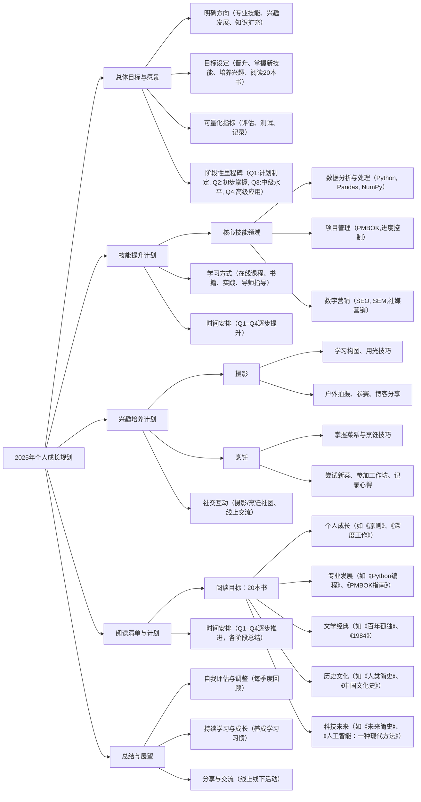

```mermaid
graph LR
    A[2025年个人成长规划]
    A --> B[总体目标与愿景]
    A --> C[技能提升计划]
    A --> D[兴趣培养计划]
    A --> E[阅读清单与计划]
    A --> F[总结与展望]

    %% 总体目标与愿景
    B --> B1[明确方向（专业技能、兴趣发展、知识扩充）]
    B --> B2[目标设定（晋升、掌握新技能、培养兴趣、阅读20本书）]
    B --> B3[可量化指标（评估、测试、记录）]
    B --> B4[阶段性里程碑（Q1:计划制定, Q2:初步掌握, Q3:中级水平, Q4:高级应用）]

    %% 技能提升计划
    C --> C1[核心技能领域]
    C1 --> C1a[数据分析与处理（Python, Pandas, NumPy）]
    C1 --> C1b[项目管理（PMBOK,进度控制）]
    C1 --> C1c[数字营销（SEO, SEM,社媒营销）]
    C --> C2[学习方式（在线课程、书籍、实践、导师指导）]
    C --> C3[时间安排（Q1–Q4逐步提升）]

    %% 兴趣培养计划
    D --> D1[摄影]
    D1 --> D1a[学习构图、用光技巧]
    D1 --> D1b[户外拍摄、参赛、博客分享]
    D --> D2[烹饪]
    D2 --> D2a[掌握菜系与烹饪技巧]
    D2 --> D2b[尝试新菜、参加工作坊、记录心得]
    D --> D3[社交互动（摄影/烹饪社团、线上交流）]

    %% 阅读清单与计划
    E --> E1[阅读目标：20本书]
    E1 --> E1a[个人成长（如《原则》、《深度工作》）]
    E1 --> E1b[专业发展（如《Python编程》、《PMBOK指南》）]
    E1 --> E1c[文学经典（如《百年孤独》、《1984》）]
    E1 --> E1d[历史文化（如《人类简史》、《中国文化史》）]
    E1 --> E1e[科技未来（如《未来简史》、《人工智能：一种现代方法》）]
    E --> E2[时间安排（Q1–Q4逐步推进，各阶段总结）]

    %% 总结与展望
    F --> F1[自我评估与调整（每季度回顾）]
    F --> F2[持续学习与成长（养成学习习惯）]
    F --> F3[分享与交流（线上线下活动）]
```
